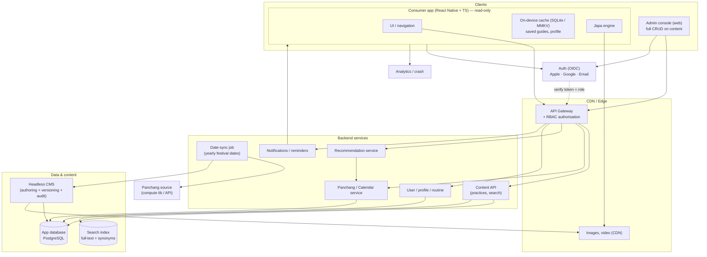

# Mantrify — Product & Technical Design Document

*A guided prayer companion for Hindus, from first-timers to lifelong devotees.*

Version 0.2 (concept) · Mobile-first

*Changelog 0.2: added account roles & access control (Admin / User), explicit multi-provider sign-in (Apple / Google / Email), dynamically synced yearly festival dates, Chalisas as a content type, and an App Store / Play Store deployment & compliance section.*

---

## 1. Overview

Mantrify is a mobile app that teaches people **how** to pray in the Hindu tradition — puja, mantra, aarti, stotra, chalisa, vrat and more — and tells them **when** each practice is traditionally observed. It removes the two biggest barriers a modern devotee faces: not knowing what to do on a given day, and not knowing how to actually do it step by step.

The app is built around a living **calendar** (the Hindu Panchang) that surfaces the right practices for each day, week and month, paired with **step-by-step guides** that show the chant in full — Devanagari, a romanised transliteration, and an English meaning for every line, which the reader can toggle on or off. Alongside the calendar there is an optional **daily routine** the user can build for themselves, and a searchable **library** for occasion-based prayers ("what do I do when I move into a new house?").

It ships in **English first**, with **Hindi and Sanskrit** for the chants and key content, and is designed so more languages can be added without re-engineering. The full library and all features are **free**.

### Design pillars

1. **Never leave the user guessing.** Every screen answers "what now, and how?"
2. **Respect the tradition.** Content is accurate, sourced, and sensitive to the diversity of Hindu practice — not a single homogenised version.
3. **Calm, not cluttered.** The interface should feel like a quiet corner of a temple, not a busy feed.
4. **Meet people where they are.** A nervous 22-year-old and a seasoned grandmother should both feel it was built for them.

---

## 2. Problem & opportunity

Many young Hindus — especially in the diaspora — grew up around prayer but were never formally taught it. They feel a pull toward practice but are embarrassed to ask, unsure which deity is associated with which day, what a puja actually involves, or how to pronounce a mantra correctly. Existing resources are scattered: YouTube videos of varying quality, PDFs, family knowledge that wasn't passed down, and apps that are either cluttered devotional portals or single-purpose (one aarti, one calendar).

Mantrify's opportunity is to be the **trusted, structured, beautiful** guide that sits between "I want to pray" and "I know how" — and to keep users engaged through the natural rhythm of the Hindu year.

---

## 3. Target users & personas

**Persona A — Aarav, 24, "the willing beginner."** Grew up in the UK, parents are observant, he is not — but wants to reconnect. Doesn't know mantras, can't read Devanagari, worried about "doing it wrong." *Needs:* gentle onboarding, transliteration + audio, plain-English explanations of why, and small daily wins.

**Persona B — Priya, 38, "the busy practitioner."** Prays semi-regularly, knows the basics, wants structure and reminders, and help with the occasions she encounters less often (a relative's shraddha, a new car). *Needs:* fast calendar at a glance, a personal routine, reliable occasion-based guides.

**Persona C — Lakshmi, 67, "the keeper."** Deeply experienced, uses the app to check exact tithi timings, find the correct vrat katha, and to share practices with her grandchildren. *Needs:* accuracy, depth, Devanagari/Hindi, larger type, the ability to go deep.

These three define the spread: the UI must scale from "hold my hand" to "get out of my way."

---

## 4. Core feature set

| Module | What it does |
|---|---|
| **Today** | A daily home screen: the date in the Hindu calendar, the deity/observance of the day, recommended practices, and the user's routine for today. |
| **Calendar** | Month / week / day views of the Panchang — festivals, vrats, ekadashi, pradosh, amavasya/purnima — each tappable to its practices. |
| **Practice guides** | Step-by-step instructions for puja, mantra/japa, aarti, stotra, **chalisa** and vrat, with the full text in Devanagari + transliteration + per-line meaning. |
| **My Routine** | A user-built set of *optional* daily prayers (not mandatory) that appear on Today and can send reminders. |
| **Library / Explore** | A searchable, categorised catalogue including **occasion-based** prayers (new house, new vehicle, exams, travel, health, business opening, etc.). |
| **Personalisation** | Tradition/sampradaya, region, chosen deities (ishta-devata), language and difficulty drive what the app surfaces. |
| **Accounts & roles** | Two roles: **Admin** (full create/read/update/delete on all prayer content) and **User** (read-only). |
| **Sign-in** | Sign in with **Apple**, **Google**, or **email** — plus guest browsing before sign-up. |

---

## 5. Functional requirements

### 5.1 Onboarding & personalisation
- The app asks the user, in a few light steps, for: preferred **language**, **experience level** (new / some / experienced), **tradition** (e.g. Vaishnava, Shaiva, Shakta, Smarta, "not sure / show me everything"), **region/style** (North Indian, South Indian, etc.), and optionally an **ishta-devata** (chosen deity).
- Every choice is **skippable** and editable later; "not sure" is always a first-class answer and never blocks progress.
- Personalisation adjusts recommendations and ordering only — it never hides the ability to search for anything.

### 5.2 Calendar (Panchang)
- Show the current **tithi, paksha, nakshatra, vara (weekday), masa** and any special day flags.
- Day / week / month views. Month view marks festivals and observances with subtle icons.
- Localised to the user's **location and timezone** for sunrise/sunset-dependent timings (tithi transitions, auspicious windows).
- Each calendar entry links to its associated practice guide(s).
- Weekly deity associations surfaced (e.g. Monday–Shiva, Tuesday–Hanuman/Devi, Thursday–Vishnu/Guru, Saturday–Shani/Hanuman) as gentle suggestions.

### 5.3 Practice guides
- Each guide is a **sequence of steps**. A step contains: a plain-language instruction, an optional mantra reference, optional image/animation, and an estimated time.
- The **full prayer** is shown in its own section — every verse, in Devanagari + transliteration — with an **English meaning for each line that the reader can toggle on or off**, line by line or all at once.
- A **materials (samagri) checklist** is shown up front (e.g. lamp, wick, ghee, flowers, incense, water, prasad).
- Guides exist at multiple depths: a **simple** 5-step panchopachara version and a fuller 16-step shodashopachara version where appropriate, selectable by experience level.
- A **japa / mala counter** for mantra repetition (e.g. tracks toward 108) with haptic feedback and a progress ring.
- A **"why" panel** on every guide explaining the significance in approachable terms.
- **Chalisas** (40-verse devotional hymns such as the **Hanuman Chalisa**, **Durga Chalisa**, **Shiv Chalisa**, **Ganesh Chalisa**) are supported as a first-class type: every verse (chaupai/doha) is shown in full in Devanagari + transliteration + per-line meaning, grouped into sections (opening dohas, chaupais, closing doha).
- Mark a guide as **done**; completions feed streaks and history.

### 5.4 Daily routine
- User assembles a personal routine from suggested daily practices (e.g. a short morning prayer, Gayatri japa, lighting a lamp, an evening aarti).
- These are explicitly framed as **optional / recommended, not mandatory**.
- Configurable reminders per item (time, days of week).
- Routine items appear on the **Today** screen and contribute to a gentle streak.

### 5.5 Library / Explore (incl. miscellaneous occasions)
- Browse by **type** (Puja, Mantra, Aarti, Chalisa, Stotra, Vrat), by **deity**, by **festival**, and by **occasion/life event**.
- **Occasion-based search** is the headline of this section: free-text and tag search for things like *"new house" (Griha Pravesh)*, *"new vehicle" (Vahan Puja)*, *"starting studies" (Vidyarambh / Saraswati)*, *"travel safety"*, *"business opening / new shop" (Lakshmi Puja)*, *"recovery / health" (Maha Mrityunjaya)*, *"naming a baby" (Namkaran)*.
- Search supports synonyms and both English and Hindi/Sanskrit terms (e.g. "housewarming" → Griha Pravesh).
- Results respect personalisation but never exclude content the user searches for explicitly.

### 5.6 Cross-cutting
- **Offline access** to saved/downloaded guides.
- **Favourites / bookmarks** and a **history** of completed practices.
- **Sharing** a guide with family (deep link).
- **Accessibility**: dynamic type, high-contrast mode, screen-reader labels (especially for transliteration vs. Devanagari), reduced motion.

### 5.7 Accounts, roles & access control
Two account roles, with role-based access control (RBAC) enforced on the **server**, never only in the app:

- **User (default).** Read-only access to all prayer content. Can build a routine, favourite, complete practices, set reminders, and manage their own profile. A User can **never** create, edit or delete prayer content.
- **Admin.** Full **create / read / update / delete** on every content object — practices, steps, mantras, chalisas, festivals, occasions, deities, media and translations — plus the ability to publish, unpublish, schedule, and roll back versions. Admins also triage user-submitted accuracy reports.

Design rules:
- Role lives on the server identity record; the API authorises every write against it. The mobile app for end users ships **no** content-editing UI at all — admin work happens in a separate **admin console** (web), so the consumer app submitted to the stores contains only read paths.
- All admin writes are **audit-logged** (who changed what, when, with before/after) and content is **versioned** so a bad edit can be reverted.
- Editorial review (the §9.3 governance) can be modelled as finer-grained permissions inside the CMS (e.g. author vs. reviewer vs. publisher), but the product-level contract the user asked for is simply **Admin = full CRUD, User = read**.

### 5.8 Authentication & sign-in
- Users can sign in with **Sign in with Apple**, **Google**, or **email** (passwordless magic-link or email + password). **Guest mode** lets someone explore before creating an account.
- Offering Sign in with Apple alongside Google is not just a nicety — it satisfies Apple's App Store rule (see §13a): an app that uses a third-party/social login to set up the primary account must also offer an equivalent login that limits data collection to name and email, lets users keep their email private, and doesn't track for ads. Sign in with Apple meets this; Google sign-in alone does not.
- **Identity tokens are always verified on the backend** — the client never self-certifies its role or identity. The backend mints its own session/JWT after verifying the provider token.
- Account **linking** (same person, multiple providers → one account) is keyed on verified email. Apple's private-relay emails are stored and respected.
- Admin accounts are **not** self-service: a User is elevated to Admin only by an existing Admin (or via a seeded super-admin), and admin sign-in to the console should require a second factor.

---

## 6. Non-functional requirements

- **Performance:** Today screen interactive in under ~1.5s on a mid-range phone; calendar paging feels instant; audio starts in under ~1s once cached.
- **Reliability:** Core content (Today, saved guides) works offline. Calendar computations are deterministic and verifiable.
- **Accuracy & trust:** All devotional content is reviewed by qualified practitioners and sourced; the app states tradition/region for each guide and avoids presenting one variant as "the only way."
- **Privacy:** Spiritual practice is sensitive personal data; collect the minimum, keep it private by default, no selling of data.
- **Scalability:** Content and language sets grow without code changes (content-driven, not hard-coded).
- **Maintainability:** Content team can publish and correct guides without engineering involvement (via a CMS).

---

## 7. Information architecture

```
Mantrify
├── Onboarding (language → experience → tradition → region → ishta-devata)
│
├── [Tab] Today
│     ├── Hindu date + observance of the day
│     ├── Recommended for today (calendar-driven)
│     └── My routine for today
│
├── [Tab] Calendar
│     ├── Month view (festival/vrat markers)
│     ├── Week view
│     └── Day detail → Practice guides
│
├── [Tab] Explore
│     ├── By type · By deity · By festival · By occasion
│     ├── Occasion search ("new house", "exams"…)
│     └── Practice guide
│           ├── Overview + "why" + materials
│           ├── Full prayer (Devanagari / transliteration / toggleable per-line meaning)
│           ├── Step-by-step instructions
│           └── Japa counter
│
├── [Tab] Routine
│     ├── My daily practices
│     └── Reminders
│
├── [Tab] Favorites
│     └── Saved mantras, aartis, chalisas & more
│
└── [Tab] Profile
      ├── Personalisation & language
      └── Streaks & history · Favourites
```

Six bottom-nav tabs keep navigation flat and learnable: **Today, Calendar, Explore, Favorites, Routine, Profile.**

---

## 8. Screen designs

An interactive HTML prototype of the key screens accompanies this document. Below is the intent of each.

**8.1 Onboarding.** Full-bleed calm imagery (a lamp glow at dawn). One question per screen, large tappable choices, a visible "Skip" on every step. Ends on a single "You're set" screen that drops straight into Today.

**8.2 Today (home).** The emotional core. Top: the Gregorian date and the Hindu date (tithi, paksha, masa) and "what today is" (e.g. *Maha Shivaratri*, or simply *"Monday — a day for Shiva"*). A hero **observance card** for the day. Below: **Recommended for today** (1–3 cards) and **My routine** with check-off. Tapping any card opens a practice guide.

**8.3 Calendar.** Month grid with restrained markers — a small flame for festivals, a dot for ekadashi/vrat. A strip showing the live tithi/nakshatra. Selecting a day reveals its observances and linked guides in a sheet. Toggle for month / week / day.

**8.4 Practice guide (the workhorse screen).** Header with deity image, title, type tag, duration and difficulty. A **materials checklist**. A **"why this matters"** panel. Then the **full prayer**, every verse shown in three registers — Devanagari, transliteration and English meaning — where the meaning of each line can be toggled on or off (a single "Meanings" switch reveals them all, or tap any line individually). Below, the **step-by-step instructions**. For mantra practices, a **japa counter ring** that fills toward 108 with haptics. A "Mark done" action at the end.

**8.5 Explore.** Prominent search bar with example chips ("New house", "Exams", "Travel", "New car"). Below, browse rails by Occasion, Type, Deity and Festival. This is where the *miscellaneous occasion* prayers live.

**8.6 Routine.** A simple list the user composes; each item has a time/days reminder toggle. Clear framing that these are optional daily practices.

**8.7 Favorites.** Saved prayers, grouped by type (mantras, aartis, chalisas, stotras, pujas), for quick access. Each can be removed with a tap; an empty state points to Explore.

**8.8 Profile.** Personalisation, language switch, streak and history, and a shortcut to favourites.

### Visual language
- **Mood:** the quiet of *brahma muhurta* (pre-dawn) — calm, warm, reverent, uncluttered.
- **Palette:** soft warm paper surfaces; deep ink text; **marigold/saffron** as the single action accent; a deep **indigo/peacock** for the Today hero; **brass gold** reserved for special days.
- **Type:** a warm display serif for headings; a clean humanist sans for body and UI; **Noto Serif/Sans Devanagari** for Sanskrit/Hindi so the script is rendered with proper conjuncts.
- **Signature element:** a **diya (lamp) glow** motif and the circular **mala/japa ring**; sparing rangoli-geometry dividers rather than heavy ornament.

---

## 9. Content model & governance

The product *is* its content. Engineering exists to deliver it correctly.

### 9.1 The Practice entity (core content object)
```
Practice
  id
  type            puja | mantra | aarti | chalisa | stotra | vrat | sankalpa
  title           { localized }
  deity           reference (e.g. Ganesha, Shiva, Lakshmi)
  traditionTags   [vaishnava, shaiva, shakta, smarta, …]
  regionTags      [north, south, east, west, universal]
  difficulty      beginner | intermediate | advanced
  estDurationMin
  summary         { localized }
  why             { localized }            # significance, plain language
  occasions       [griha-pravesh, exams, travel, …]   # for Explore search
  calendarLinks   [tithi/weekday/festival associations]
  variants        [Practice]               # e.g. 5-step vs 16-step versions
  materials       [ { item:{localized}, optional:bool } ]
  steps           [ Step ]
  mantras         [ MantraSection ]        # grouped verses; each line carries its own meaning
  media           { deityImage, video? }
  sources         [ citation ]             # provenance for trust
  reviewedBy      [ reviewer ]             # editorial governance

Step
  order, instruction:{localized}, mantraRef?, imageRef?, estSec, optional

MantraSection
  label?        e.g. "Opening Dohas", "Chaupais", "Closing Doha"
  repetitionTarget?  (e.g. 108, for japa)
  lines         [ MantraLine ]            # the prayer shown in full, verse by verse

MantraLine
  devanagari, transliteration(IAST), meaning:{localized}   # per-line meaning, toggleable in the UI
```

### 9.2 Calendar engine & dynamic yearly dates
A **Panchang service** computes, per date + location: tithi, paksha, nakshatra, yoga, karana, vara, masa, and flags (ekadashi, pradosh, amavasya, purnima, sankranti) plus a curated **festival table**. A lightweight **recommendation step** maps `(PanchangDay × UserProfile)` to a ranked list of Practices via their `calendarLinks` and the user's tradition/region/ishta-devata.

**Why dates must be dynamic.** The Hindu calendar is **lunisolar**, so festivals and observances fall on *different Gregorian dates every year* — Diwali, Holi, Navratri, Janmashtami, each Ekadashi and so on shift annually, and some vary by region. Hard-coding dates would silently rot. Mantrify therefore treats the year's dates as **data that is refreshed automatically**, not shipped in the app binary.

**How the sync works.**
- A scheduled **date-sync job** (e.g. a nightly/weekly cron worker) pulls the upcoming window of dates from a **source of truth** and writes them into the database/CMS. The source is one of:
  - an **astronomical computation library** that derives tithi/nakshatra/festival dates deterministically from latitude/longitude + date (no external dependency, works for any future year), or
  - a **vetted third-party Panchang/festival API or dataset**, cached locally.
  - In practice, **both**: computation for the precise per-location panchang fields, layered with a **reviewed festival/observance table** for the cultural rules (regional variants, named festivals) that pure computation doesn't encode.
- Synced dates land in a **draft/staging** state and are **reviewed/approved by an Admin** before going live (the same governance as content) — automation proposes, a human confirms. An Admin can also override or add a date by hand.
- The mobile app **fetches the current calendar from the backend** (with offline caching), so a corrected or newly published date appears without an app-store update.
- Results are computed/served **per user location and timezone**, because sunrise/sunset-dependent timings shift the day a tithi or festival is observed.

### 9.3 Editorial governance (non-negotiable)
- Every Practice is authored and **reviewed by qualified practitioners/scholars** and carries `sources` and `reviewedBy`.
- Each guide **states its tradition and region**; where practice varies, the app shows variants rather than asserting one correct form.
- A clear **feedback/report** path lets users flag inaccuracies, routed to the content team.
- Transliteration follows a documented scheme (IAST) for consistency.

---

## 10. Localisation

- **UI strings:** standard i18n (ICU message format) with English as the base; Hindi UI as a fast follow.
- **Content:** the `{ localized }` fields hold per-language values; chants always retain **Devanagari + transliteration**, with meaning translated per language.
- Architecture supports **right-to-left and additional scripts** later (e.g. Tamil, Telugu, Gujarati, Bengali) without schema changes — add a locale, add content.
- Numerals, dates and the Panchang are locale- and timezone-aware.

---

## 11. Access

The app is **entirely free**. The full library — every aarti, mantra, chalisa, stotra and puja — together with the calendar, routine, favourites and reminders, is available to all users with no paywall, no premium tier and no ads. There is no in-app purchase or subscription billing of any kind.

---

## 12. Technical architecture

### 12.1 High-level



Note the two clients: the **consumer app** (read-only, submitted to the stores) and a separate **admin console** (web) where Admins perform CRUD. Both authenticate via the same provider, but the API gateway authorises every write against the caller's **role**, so even a tampered client cannot edit content.

### 12.2 Client (mobile)
- **React Native + TypeScript** (or Flutter) for one codebase across iOS and Android, fast iteration, and a strong native feel. RN is recommended for the larger hiring pool and mature native ecosystem; Flutter is a reasonable alternative if the team prefers it.
- **State/data:** TanStack Query for server state + caching; a small client store for UI/session.
- **Offline:** content cached in **SQLite/MMKV** and the file system; downloads available to all users.
- **Interaction:** haptics for the japa counter; smooth verse-by-verse scrolling for long chalisas.
- **Navigation:** six-tab bottom navigation; deep links for sharing guides and notification taps.

### 12.3 Backend
- **API style:** a gateway fronting modular services. **GraphQL or REST**; GraphQL fits the content graph (a guide pulls deity, steps, mantras, media in one query) but REST is fine for v1 simplicity.
- **Services:** Content/Search, Panchang/Calendar, Recommendation, User/Profile/Routine, Notifications.
- **Runtime:** Node.js/TypeScript (shared types with the client) or another team-preferred stack; containerised, horizontally scalable.

### 12.4 Data & content
- **Headless CMS** (e.g. Strapi/Sanity/Contentful-class) so the content team authors and corrects Practices with the editorial workflow from §9.3 — engineering does not gate content.
- **PostgreSQL** as the primary store for users, routines, favourites and structured content references.
- **Search index** (e.g. an OpenSearch/Typesense/Meilisearch-class engine) for the Explore experience, configured with **synonyms** so "housewarming" finds Griha Pravesh and English/Hindi terms cross-map.
- **Object storage + CDN** for images/video, served via signed URLs.

### 12.5 Panchang / calendar
- Either an **astronomical computation library** (deterministic, no per-call cost, fully offline-capable for core fields) or a vetted Panchang API, with results **cached per date+location**. A curated, reviewed **festival/observance table** sits on top, because festival dates involve regional and sampradaya-specific rules that pure computation does not capture.
- A **date-sync job** runs on a schedule (cron worker) to refresh the rolling year(s) of festival/observance dates from the source above into the CMS/DB, in a draft state for Admin approval. Because the app reads the calendar from the backend, the **yearly date changes propagate without an app-store release**.

### 12.6 Identity, roles, notifications
- **Auth:** OIDC with three sign-in methods — **Sign in with Apple, Google, and email** (magic-link or password) — plus anonymous/guest mode. Provider tokens are **verified server-side**; the backend issues its own session JWT containing the user id and **role**. Offering Apple alongside Google is required for App Store approval (§13a). A managed identity provider (e.g. Auth0/Clerk/Firebase Auth/Cognito-class) or a self-hosted OIDC stack both work; the choice doesn't affect the rest of the design.
- **Roles / RBAC:** the JWT carries `role ∈ {user, admin}`. The API gateway and services authorise **every mutating request** against it; the consumer app has no write endpoints exposed in its UI, and the admin console is gated to admins with a second factor. All admin writes are audit-logged and content is versioned.
- **Notifications:** push for routine reminders and festival nudges, scheduled respectfully (user-controlled times, easy to silence).

### 12.7 Cross-cutting
- **Analytics & crash reporting** with a privacy-first posture (see §13).
- **CI/CD** with automated builds and store deployment (e.g. Fastlane + EAS/CI).
- **Observability:** logging, metrics, alerting on the backend services.

### 12.8 Illustrative API surface
```
# Auth
POST /v1/auth/apple | /v1/auth/google | /v1/auth/email   → verify provider token, issue session JWT (+role)

# Read (user + admin)
GET  /v1/today?date=&lat=&lng=&tz=          → panchang + observances + recommendations
GET  /v1/calendar?from=&to=&lat=&lng=       → days with markers (server-driven, dynamic dates)
GET  /v1/practices/{id}?lang=               → full guide (steps, mantras, media)
GET  /v1/search?q=&type=&deity=&occasion=   → practice results (synonym-aware; type incl. chalisa)
GET  /v1/me/routine        POST /v1/me/routine
POST /v1/me/completions                     → log a completed practice
GET  /v1/me/favorites      POST/DELETE /v1/me/favorites/{practiceId}

# Admin-only (RBAC: role=admin; audited; versioned) — used by the web admin console
POST   /v1/admin/practices                  → create
PUT    /v1/admin/practices/{id}             → update
DELETE /v1/admin/practices/{id}             → delete
POST   /v1/admin/practices/{id}/publish     → publish / unpublish / schedule
GET/POST/PUT/DELETE /v1/admin/festivals     → manage festival dates (review synced drafts, override)
PUT    /v1/admin/users/{id}/role            → elevate/demote (admin only)
```

### 12.9 Data model (relational sketch)
```
users(id, email, email_private, role[user|admin], locale, region, tradition,
      experience, ishta_devata, created_at, …)        # role drives RBAC
auth_identities(id, user_id, provider[apple|google|email], provider_subject, verified)
profiles_settings(user_id, notif_prefs, type_scale, theme, …)
routines(id, user_id)            routine_items(id, routine_id, practice_id, reminder)
completions(id, user_id, practice_id, completed_at)
favorites(user_id, practice_id)
festival_dates(id, festival_id, gregorian_date, region, status[draft|published],
      source[computed|api|manual], reviewed_by, year)  # refreshed yearly by date-sync job
content_versions(id, practice_id, version, body, created_by, created_at)  # rollback
audit_log(id, actor_id, action, entity, entity_id, before, after, at)     # admin writes
# Practices/Steps/Mantras/Chalisas/Media live in the CMS, referenced by id and indexed for search
```

### 12.10 Admin console (web)
A separate web app (not shipped in the mobile binary) for Admins to manage all content: create/edit/delete practices, steps, mantras, chalisas, deities, occasions and festival dates; upload images; manage translations; review the date-sync job's drafts; publish/schedule/roll back; triage user accuracy reports; and elevate/demote roles. It calls the same `/v1/admin/*` endpoints, is gated to `role=admin` with a second factor, and every action is audit-logged. This separation is also what keeps the consumer app a clean **read-only** client for store review.

---

## 13. Security, privacy & compliance

- **Minimal collection.** Religious belief/practice is sensitive personal data under GDPR (special category) and similar laws; collect only what the experience needs and make it private by default.
- **Encryption** in transit (TLS) and at rest; secrets managed properly; signed URLs for media.
- **No data sale, no ad targeting.** Analytics anonymised/aggregated; clear consent for anything beyond the essential.
- **User control:** export and delete account/data; granular notification control.
- **Store & platform compliance:** accessibility standards (WCAG-aligned where applicable).

---

## 13a. App Store & Play Store deployment / compliance

The goal is a binary that passes review on the first try. The biggest reason this design is store-ready is the clean split: the consumer app is **read-only** and all editing lives in a separate admin console. The app is **free with no in-app purchases**, which removes an entire class of payment-related review requirements. Concrete requirements:

**Sign-in (Apple Guideline 4.8 — "Login Services").** Because the app offers Google sign-in to set up the primary account, Apple requires an *equivalent* option that (a) limits data collection to name and email, (b) lets the user keep their email private, and (c) doesn't collect in-app interactions for advertising without consent. **Sign in with Apple satisfies all three** — which is exactly why Apple + Google + email is the right set. Verify the Apple identity token on the backend, use Apple's official "Sign in with Apple" button assets, and store the name/email Apple returns on **first** authorisation (it isn't sent again).

**Reviewer access (login-gated apps).** Since the app has accounts, App Review needs working **demo credentials** in the review notes — provide a **User** demo account (and, if you want them to see admin, note that admin is a separate web console, not in the app). Make sure the demo account exercises the full feature set.

**Completeness & UGC.** The build must be fully functional — no placeholder screens, dead buttons, or lorem ipsum (a top first-time rejection cause). The only user-generated input here is the *accuracy-report* flow; keep it minimal, or if any user content becomes visible to others, add moderation with a path to act on reports quickly and a block/report mechanism.

**Privacy disclosures.** Complete the iOS **Privacy Nutrition Labels** (App Store Connect) and the **Google Play Data Safety** form, and host a public **privacy policy** (linked in-app and in store metadata). Treat religious practice as sensitive data: collect the minimum, don't track for ads, and offer in-app account/data deletion (required by both stores).

**Age rating & content.** Set an appropriate content/age rating; devotional content is broadly suitable but complete the questionnaires honestly. If the app is ever aimed at children, the stricter Kids-category rules apply (it isn't — target is teens/adults).

**Google Play testing gate.** New **personal** Play developer accounts must run a **closed test with at least ~12 testers for ~14 days** before they can apply for production access — plan this into the launch timeline (organisation accounts differ). Budget for both stores' review queues.

**Build & release pipeline.** Apple Developer Program ($99/yr) and Google Play Console ($25 one-off) memberships; signing/provisioning; **Fastlane + EAS/CI** for automated builds and store uploads; TestFlight (iOS) and Play internal/closed tracks for staging. Every new version is re-reviewed, so keep submissions small and the demo account current.

> Store rules change frequently — re-check the current App Store Review Guidelines (esp. 4.8 and 3.1) and Google Play policies at submission time rather than relying on this summary.

---

## 14. Roadmap

**MVP (v1) — prove the core loop.**
English UI; **sign in with Apple / Google / email + guest mode**; **User and Admin roles** with a basic **admin console** for content CRUD; Today + month Calendar with **dynamically synced festival dates** (date-sync job + Admin approval); ~30–50 reviewed guides spanning the major aartis, key mantras, a beginner puja, **core chalisas (e.g. Hanuman Chalisa)**, and the top occasion-based prayers; step/verse player with Devanagari + transliteration + per-line meaning; japa counter; basic routine with reminders; favourites; **fully free, no in-app purchases**; **App Store & Play compliance (§13a)**; iOS + Android.

**v1.x.** Offline downloads; expanded library; Explore synonym search polish; streaks/history; sharing.

**v2.** Hindi UI; advanced/16-step puja variants; richer Panchang (auspicious windows); deeper festival content; family sharing; **audio recitation** (verse-by-verse follow-along recorded by competent reciters) — explicitly out of scope for v1.

**Later.** Additional languages and scripts (Tamil, Telugu, Gujarati, Bengali…); audio pronunciation coaching; community/temple features; tablet/web companion.

---

## 15. Key risks & open questions

- **Cultural accuracy and breadth.** The single biggest risk. Mitigation: the editorial governance in §9.3, explicit tradition/region labelling, variants over assertions, and a visible correction path. This is a content-and-trust product before it is a software product.
- **Panchang correctness.** Festival dates and timings vary by region/sampradaya. Mitigation: curated, reviewed festival tables on top of computation; location-aware timings.
- **Open questions for the next session:** which traditions/regions to cover first; target launch markets; whether to license or build the Panchang engine; and whether a web companion is in scope early.
